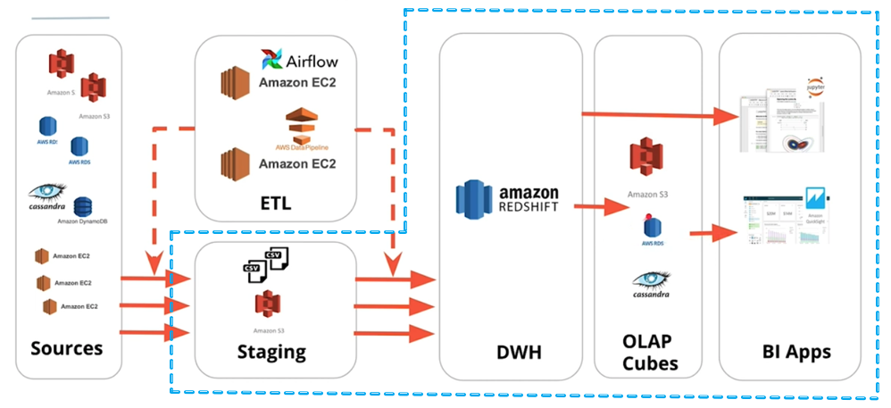

# DW-on-AWS-Redshift
# Introduction
The goal of this project is to build an ETL pipeline for a database hosted on Redshift. 
The ETL pipeline extracts the data from S3, stages it in Redshift, and transforms the data into a set of fact and dimension tables for the BI applications to consume.

# Project description
Mock music app Company, Sparkify's user base and song database has grown significantly and therefore want to move their data onto the Cloud. 
This data resides in S3, in a directory of JSON logs on user activity on the app, as well as a directory with JSON metadata on the songs in their app.
As their data engineer, you are tasked with building an ETL pipeline that extracts their data from S3, stages them in Redshift, and transforms data into a set of dimensional tables for their analytics team to continue finding insights in what songs their users are listening to.

# Data description
There are two main datasets that reside in S3.

 * Song data: s3://udacity-dend/song-data/
 * Log data: s3://udacity-dend/log-data/
 * The log format is captured in s3://udacity-dend/log_json_path.json

# Song dataset
The first dataset is a subset of real data from the Million Song Dataset. Each file is in JSON format and contains metadata about a song and the artist of that song. 

Log dataset
The second dataset consists of log files in JSON format generated by this event simulator based on the songs in the dataset above. These simulate app activity logs from an imaginary music streaming app based on configuration settings.

# Technolgy Used
* Amazon Redshift
* Python

# Database schema design:
  Staging Tables
  * staging_events
  * staging_songs
# Fact Table
* songplays - records in event data associated with song plays i.e. records with page NextSong - songplay_id, start_time, user_id, level, song_id, artist_id, session_id,  location, user_agent

# Dimension Tables

* users - users in the app - user_id, first_name, last_name, gender, level
* songs - songs in music database - song_id, title, artist_id, year, duration
* artists - artists in music database - artist_id, name, location, lattitude, longitude
* time - timestamps of records in songplays broken down into specific units - start_time, hour, day, week, month, year, weekday

# Star Schema

# Project Design
* create_cluster.py : This script creates the redshift cluster on AWS.
* create_tables.py: Script for creating the staging and star-schema tables.
* etl.py: Script for loading data into staging tables and then inserting data into star-schema.
* sql_queries.py: Script contains all the queries used by create_tables.py and etl.py.
* dwh.cfg: Configuration file used by create_tables.py and etl.py,create_cluster.py,delete_cluster.py
* delete_cluster.py: This script is used to delete the cluster.

# Project Execution
* Step 1: Fill the configuration parameters in the dwh.cfg in the project root folder.
* Step 2: Run the create_cluster script to set up the needed infrastructure for this project.
* Step 3: Run the create_tables script to set up the database staging and analytical tables.
* Step 4: Run the etl script to extract data from the files in S3, stage it in redshift, and finally store it in the dimensional tables.
* Step 5 : Run the analytics.py to check if all the tables are populated.
* Step 6 : Delete the cluster using delete_cluster.py

